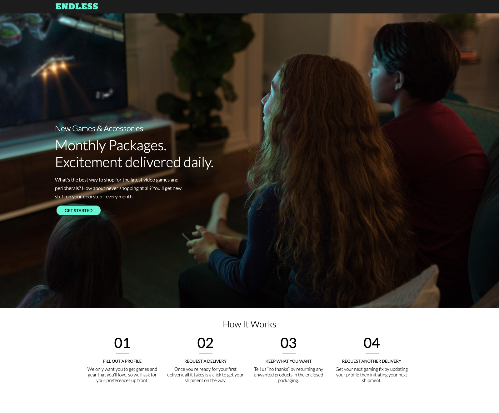

# Endless

A single-page React application for fictitious company, Endless. The goal of this project was to build a landing page based off of the design comp provided. A REST API was used to retrieve steps for the "How It Works" section. The steps were then sorted by step number and correct information was extracted by comparing the dates of each version content object.

View the deployed application <a href = "https://endless-games.netlify.app/">here</a>

## Table of Contents

- [Installation](#installation)
- [Resources](#resources)
- [Questions](#questions)
- [License](#license)

## Installation

If you would like to use the application in your local environment:

1. Clone the repo
2. Install required dependencies by running command `npm i`
3. Run command `npm start`

Otherwise, visit the deployed application <a href = "https://endless-games.netlify.app/">here</a>

## Resources

**React**  
**Custom REST API**  
**Flexbox**  
**Axios**  
**Google Fonts**

## Questions

If you have any further questions, feel free to reach out to me!  
<a href='https://www.github.com/twkirkpatrick'>Github</a>  
<a href='mailto:twk4491@gmail.com'>twk4491@gmail.com</a>

## License

Usage is provided under the MIT license.
